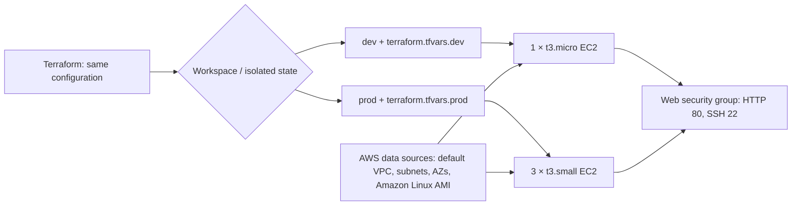

# Automated Multi-Environment Cloud Infrastructure Deployment Using Terraform and AWS

## 1. Project overview

This college MSE project provisions a small AWS web-server environment from reusable Terraform code. One configuration supports two isolated environments: `dev` and `prod`. Terraform workspaces keep each environment's state separate, while environment-specific `.tfvars` files supply the configuration values.

## 2. Problem statement

Teams often duplicate infrastructure scripts for development and production. That makes changes inconsistent and difficult to audit. This project solves that problem by defining infrastructure once and selecting the environment through a Terraform workspace and variable file.

## 3. Objective

- Build reusable AWS Infrastructure as Code (IaC).
- Isolate development and production state with Terraform workspaces.
- Provision tagged EC2 web servers with environment-appropriate capacity.
- Discover AWS network and machine-image information dynamically instead of hardcoding IDs.

## 4. Technologies used

- Terraform 1.3 or later
- HashiCorp AWS provider 5.x
- AWS: default VPC, subnets, availability zones, Amazon Linux 2023, security groups, and EC2
- Bash user data to install Apache HTTP Server

## 5. Architecture



The configuration discovers the account's default VPC and its subnets, available availability zones, and the latest matching Amazon Linux 2023 AMI. It creates one security group and the requested number of web servers. Each server installs Apache and serves a small environment-labelled page.

## 6. Terraform concepts demonstrated

- Provider requirements and provider configuration
- Input variables, validation rules, locals, and environment-specific `.tfvars` files
- Terraform workspaces and workspace-isolated state
- AWS data sources: `aws_vpc`, `aws_subnets`, `aws_availability_zones`, and `aws_ami`
- Resources, `count`, `count.index`, expressions, lifecycle preconditions, outputs, and tags

## 7. Project structure

```text
terraform-aws-multi-environment/
├── main.tf                   # Data sources, security group, and EC2 servers
├── variables.tf              # Input variables and validation
├── terraform.tf              # Terraform and AWS provider requirements
├── outputs.tf                # Values displayed after apply
├── terraform.tfvars.dev      # Dev inputs
├── terraform.tfvars.prod     # Prod inputs
├── .gitignore                # State and local-secret protection
├── README.md                 # This guide
└── AGENTS.md                 # Constraints for future coding agents
```

## 8. Workspaces

Terraform's local backend stores state separately by workspace. This project uses the two non-default workspaces `dev` and `prod`. The configuration also checks that the selected workspace matches the `environment` value in the selected variable file, preventing an accidental cross-environment plan.

The default workspace is created automatically by Terraform and should not be used for this project. Do not delete workspace state files manually.

## 9. Variables

| Variable | Purpose |
| --- | --- |
| `project_name` | Prefix for resource names and tags |
| `environment` | `dev` or `prod`; must equal the selected workspace |
| `region` | AWS region, defaulting to `ap-south-1` |
| `instance_type` | EC2 size supplied by the active tfvars file |
| `instance_count` | Number of EC2 instances; drives `count` directly |
| `allowed_ssh_cidr` | CIDR allowed to access SSH port 22 |

Before any real deployment, replace `203.0.113.0/24` in the selected tfvars file with your own public IP in CIDR form, such as `198.51.100.25/32`. It is a reserved documentation range and is intentionally not a usable administrator network.

## 10. Data sources

No VPC ID, subnet ID, or AMI ID is hardcoded. Terraform looks up:

- the default VPC using `data "aws_vpc" "default"`;
- its subnets using `data "aws_subnets" "default_vpc"`;
- available zones using `data "aws_availability_zones" "available"`; and
- the most recent matching Amazon Linux 2023 x86_64 AMI using `data "aws_ami" "amazon_linux"`.

This requires that the chosen AWS region has a default VPC with at least one subnet. See troubleshooting if it does not.

## 11. Dev environment

`terraform.tfvars.dev` defines:

```hcl
environment    = "dev"
instance_type  = "t3.micro"
instance_count = 1
```

It creates one low-cost development server named `terraform-web-dev-1`.

## 12. Prod environment

`terraform.tfvars.prod` defines:

```hcl
environment    = "prod"
instance_type  = "t3.small"
instance_count = 3
```

It creates three production servers named `terraform-web-prod-1` through `terraform-web-prod-3`.

## 13. Installation and prerequisites

1. Install [Terraform](https://developer.hashicorp.com/terraform/install) 1.3+.
2. Install and configure the [AWS CLI](https://docs.aws.amazon.com/cli/latest/userguide/getting-started-install.html).
3. Use an AWS account and IAM principal permitted to read VPC/subnet/AMI information and create EC2 instances and security groups.
4. Confirm the selected region has a default VPC and subnet.
5. From this directory, run:

   ```bash
   terraform init
   ```

`terraform init` downloads the provider and prepares Terraform; it does **not** create AWS resources.

## 14. AWS credentials setup

Never put credentials in these files or commit them. Use one of these standard approaches:

```bash
aws configure
aws sts get-caller-identity
```

Alternatively, use environment variables, an AWS named profile, IAM Identity Center, or an attached IAM role. Verify the active identity with `aws sts get-caller-identity` before planning.

## 15. Create and inspect workspaces

Create the two project workspaces once after initialization:

```bash
terraform workspace new dev
terraform workspace new prod
terraform workspace list
```

Select an environment before its plan:

```bash
terraform workspace select dev
terraform workspace select prod
```

If a workspace already exists, use `terraform workspace select <name>` instead of creating it again.

## 16. Format and validate

Run these safe checks after changes:

```bash
terraform fmt
terraform fmt -check
terraform validate
```

Formatting and validation do **not** create AWS resources. `terraform validate` requires a successful `terraform init` first.

## 17. Inspect the dev plan

```bash
terraform workspace select dev
terraform plan -var-file="terraform.tfvars.dev"
```

Review the output. It should show one `aws_instance.web[0]` with instance type `t3.micro` plus its security group. A plan reads AWS metadata/data sources but does **not** create resources.

## 18. Inspect the prod plan

```bash
terraform workspace select prod
terraform plan -var-file="terraform.tfvars.prod"
```

Review the output. It should show three instances, `aws_instance.web[0]` through `[2]`, each using `t3.small`, plus the production security group.

## 19. Applying infrastructure

Only after inspecting the matching plan and confirming the active workspace, an authorized user may run:

```bash
terraform workspace select dev
terraform apply -var-file="terraform.tfvars.dev"
```

or:

```bash
terraform workspace select prod
terraform apply -var-file="terraform.tfvars.prod"
```

**`terraform apply` is the command that creates or changes AWS resources and can incur charges.** It was intentionally not run while preparing this project.

## 20. Destroying infrastructure

When testing is complete, select the correct workspace and run:

```bash
terraform workspace select dev
terraform destroy -var-file="terraform.tfvars.dev"
```

Repeat with `prod` if it was deployed. **`terraform destroy` deletes the resources tracked in the selected workspace.** Always inspect its confirmation prompt and ensure the workspace is correct. EC2 and related AWS services can incur charges; destroy test infrastructure promptly.

## 21. Troubleshooting

- **`No valid credential sources found`**: configure AWS CLI credentials, a profile, SSO, or an IAM role, then verify with `aws sts get-caller-identity`.
- **No default VPC/subnet**: create a default VPC in the chosen region using AWS-supported account setup, or change the design to accept an approved VPC/subnet selector. Do not paste IDs into `main.tf`.
- **Workspace/environment mismatch**: select `dev` with `terraform.tfvars.dev`, or `prod` with `terraform.tfvars.prod`.
- **SSH cannot connect**: replace the documentation CIDR in the tfvars file with your current public IP `/32`; make sure the subnet/security rules and instance key-access method are appropriate.
- **`terraform validate` says provider is unavailable**: rerun `terraform init` with network access.
- **AMI/instance type unavailable**: choose a region where Amazon Linux 2023 and the requested instance family are offered.

## 22. MSE presentation/demo procedure

1. Show the directory structure and explain that `main.tf` is shared—not copied per environment.
2. Open `variables.tf` and identify the six input variables and validation rules.
3. Open both tfvars files and point out dev's one `t3.micro` versus prod's three `t3.small` servers.
4. Show the four AWS data blocks and explain why IDs are not hardcoded.
5. Run `terraform init`, then create/list `dev` and `prod` workspaces.
6. Run `terraform fmt -check` and `terraform validate`.
7. Select `dev` and run the dev plan; show its one instance and tags.
8. Select `prod` and run the prod plan; show its three instances and tags.
9. Explain that workspace state is isolated, and that apply/destroy require an explicit environment choice.
10. State the cost and cleanup rule: inspect first, apply only intentionally, and destroy test resources afterwards.

## Safety and cost notice

This repository contains no credentials and does not automatically create resources. `terraform init`, `terraform fmt`, `terraform validate`, and `terraform plan` are preparatory commands. `terraform apply` creates/changes cloud resources; `terraform destroy` deletes them. EC2 usage can incur AWS charges, so use the smallest suitable test window and destroy resources when finished.
